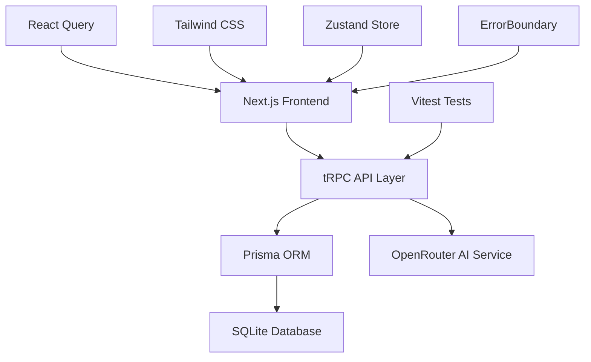

# AI Chat Application 🎯

> **A modern AI chat interface with conversation management**

An intelligent AI chat application that maintains conversation context, tracks costs, and exports conversations seamlessly. Built with modern web technologies for production use.


[🚀 **Try the Live Demo**](https://your-app.vercel.app) | [📖 **Documentation**](docs/) | [📖 **Read the Blog Post**](https://your-blog.com/building-ai-chat-app)

## 🎯 **Why This Exists**

**The Problem**: Context-switching between tools kills productivity. You research in one app, write in another, chat with AI in a third, then manually copy-paste between them.

**The Solution**: A unified workspace where AI conversations have memory, costs are transparent, and outputs integrate with your existing tools.

**The Vision**: This is the foundation for agent-powered workflows where AI can not just chat, but execute code, analyze data, and orchestrate complex tasks safely.

## ⚡ **Key Features**

### 🧠 **Persistent Memory**
- Conversations maintain full context across sessions
- SQLite database stores all chat history locally
- No more "can you remind me what we discussed yesterday?"

### 💰 **Cost Transparency**
- Real-time token usage tracking
- Per-conversation cost breakdown
- Multiple AI model support via OpenRouter

### 🔄 **Seamless Export**
- One-click export to Markdown and JSON
- Formatted exports with timestamps and metadata
- Never lose valuable AI-generated insights

### 🏗️ **Production-Ready Architecture**
- End-to-end type safety with TypeScript
- Comprehensive test suite (191/191 tests passing - 100% success rate)
- Reactive UI updates with React Query
- Centralized state management with Zustand
- Graceful error handling with ErrorBoundary components
- Professional error logging and retry mechanisms

## 🛠️ **Tech Stack & Architecture**



### **Frontend Stack**
- **Next.js 15** + **React 18** - Modern React with Pages Router
- **TypeScript** - End-to-end type safety
- **Tailwind CSS** - Utility-first styling
- **tRPC** - Type-safe API calls with React Query
- **Zustand** - Lightweight state management with DevTools
- **ErrorBoundary** - Graceful error handling and recovery

### **Backend Stack**
- **tRPC** - Type-safe API routes
- **Prisma** - Type-safe database access
- **SQLite** - Zero-config database (Postgres-ready)
- **OpenRouter** - Multi-model AI access

### **Developer Experience**
- **Vitest** + **Testing Library** - Comprehensive test suite
- **ESLint** + **Prettier** - Code quality automation
- **TypeScript** - Compile-time error checking

## 🚀 **Quick Start**

### **Prerequisites**
- Node.js 18+ 
- An OpenRouter API key ([get one free](https://openrouter.ai/))

### **1-Minute Setup**
```bash
# Clone and install
git clone https://github.com/yourusername/ai-chat-app
cd ai-chat-app
npm install

# Set up development tools (Git hooks for code quality)
npx husky install

# Configure environment
cp .env.example .env.local
# Add your OPENROUTER_API_KEY

# Set up database
npx prisma generate
npx prisma migrate dev --name init

# Start developing
npm run dev
```

Visit `http://localhost:3000` and start chatting! 🎉

### **Environment Variables**
```env
DATABASE_URL="file:./dev.db"
OPENROUTER_API_KEY="sk-or-v1-..." # Get from openrouter.ai
NEXTAUTH_SECRET="your-secret-here" # For production
```

## 🏗️ **Project Architecture**

```
src/
├── components/
│   ├── chat/           # Chat interface components
│   ├── ErrorBoundary.tsx # Error handling component
│   ├── ExportButton.tsx  # Conversation export functionality
│   └── __tests__/      # Component test suites
├── server/
│   ├── routers/        # tRPC API routes (chat, conversations, messages, export, usage)
│   ├── services/       # Business logic layer (assistant, mock assistant)
│   ├── utils/          # Server utilities (error handling, logging)
│   └── db/            # Database client and initialization
├── stores/
│   └── chatStore.ts   # Zustand state management
├── lib/
│   ├── trpc/          # tRPC client setup with timeout handling
│   └── utils.ts       # Utility functions
├── types/             # TypeScript definitions
└── test/              # Test utilities and setup
```

### **Key Design Decisions**

**🎯 tRPC over REST**: Type safety from frontend to database. No more API documentation that goes stale.

**🗄️ SQLite for Development**: Zero-config local development. Easily migrate to Postgres for production.

**🏪 Zustand for State**: Lightweight, TypeScript-first state management with DevTools integration.

**🛡️ ErrorBoundary Pattern**: Graceful error handling with user-friendly fallbacks and recovery options.

**🧪 Mock-First Testing**: Every external API has a mock. Tests run fast and don't depend on third-party services.

**📦 Monorepo Structure**: Everything in one place during early development. Easy to extract services later.

## 🧪 **Testing Strategy**

```bash
npm test          # Run all tests
npm run test:ui   # Visual test runner
npm run coverage  # Coverage report
```

**Test Coverage**: 191/191 tests passing (100% success rate) with comprehensive coverage across:
- API endpoints (tRPC routers) - All passing
- React components (Chat, ExportButton, ErrorBoundary) - All passing
- Database operations - All passing
- AI service integration - All passing
- State management (Zustand store) - All passing
- Error handling utilities - All passing
- Export functionality - All passing
- Health check endpoints - All passing
- Database initialization - All passing

## 🔮 **Roadmap & Vision**

### **Phase 1: Solid Foundation** ✅
- [x] Multi-model AI chat with cost tracking
- [x] Conversation persistence and management
- [x] Export functionality
- [x] Production-ready architecture

### **Phase 2: Agent Capabilities** (Planned)
- [ ] **Code execution integration** (perfect fit for E2B sandboxes!)
- [ ] Multi-step workflow orchestration
- [ ] Tool integration (web search, file analysis)
- [ ] Vector-based conversation search

### **Phase 3: Learning & Automation** (Planned)
- [ ] Preference learning (auto-select best models)
- [ ] Style guide enforcement  
- [ ] Proactive suggestions

**The E2B Integration Opportunity**: This architecture is designed for safe agent workflows. Imagine AI that can write Python code, execute it in E2B sandboxes, and display results inline—all while maintaining conversation context and cost tracking.

## 📚 **Documentation**

Detailed guides and technical documentation are available in the [`docs/`](docs/) folder:

- **[Architecture Summary](docs/architecture-summary.md)** - Current implementation overview
- **[Deployment Guide](docs/DEPLOYMENT.md)** - Complete deployment guide
- **[Testing Guide](docs/TESTING.md)** - Comprehensive testing documentation and best practices
- **[Agent Architecture Plan](docs/agent-architecture-plan.md)** - Future system design

## 🤝 **Contributing**

Built something cool? Found a bug? Contributions welcome!

```bash
# Set up development environment
git clone [your-fork]
npm install
npx husky install  # Set up Git hooks for code quality

# Make changes, add tests
npm run dev
npm test
npm run lint

# Submit PR with description
```

## 📄 **License**

MIT License - see [LICENSE](LICENSE) for details.

---

**Built by a developer, for developers.** If this solves a problem you have, [let me know](https://twitter.com/yourusername)!

## 🔗 **Links**
- [🚀 Live Demo](https://your-app.vercel.app)
- [📖 Technical Deep Dive](https://your-blog.com/building-ai-chat-app)
- [🐛 Report Issues](https://github.com/yourusername/ai-chat-app/issues)
- [💬 Discussions](https://github.com/yourusername/ai-chat-app/discussions)
